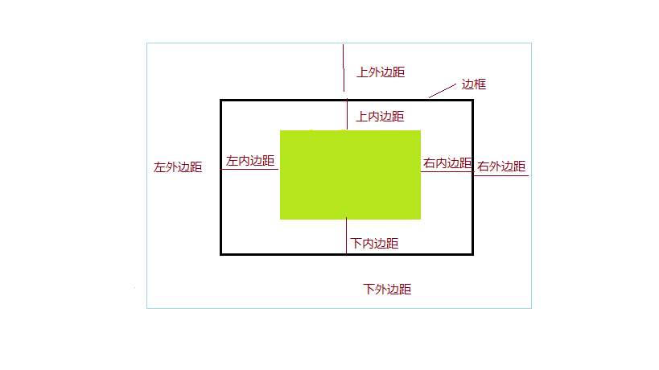

# 盒模型

> 请先阅读[菜鸟教程盒模型](http://www.runoob.com/css/css-boxmodel.html)



外边距:margin

```css
margin: 10px 15px 20px 25px;/*上右下左依次外边距 10px 15px 20px 25px */
margin:10px 15px; /*上下外边距10px 左右外边距15px */
margin:10px ; /*上右下左所有外边距都是10px*/
```
[demo5 外边距](http://htmlpreview.github.io/?https://github.com/24wings/tutorial/blob/master/css/demos/demo5.html)
[demo5 外边距源码](demos/demo5.html)

内边距:padding
```css
padding: 10px 15px 20px 25px;/*上右下左依次外边距 10px 15px 20px 25px */
padding:10px 15px; /*上下外边距10px 左右外边距15px */
padding:10px ; /*上右下左所有外边距都是10px*/
```
[demo6 内边距](http://htmlpreview.github.io/?https://github.com/24wings/tutorial/blob/master/css/demos/demo6.html)
[demo6 内边距](demos/demo6.html)


* 使用line-height和text-align:center;实现文本竖直水平居中。
原理:将文字的行高设置为父元素的height高度
[demo7 竖直水平居中的文字](http://htmlpreview.github.io/?https://github.com/24wings/tutorial/blob/master/css/demos/demo7.html)
[demo7 源码](demos/demo7.html)
