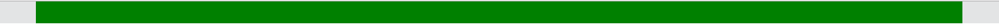
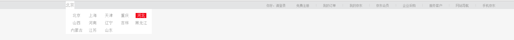
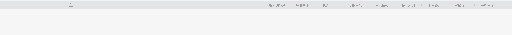
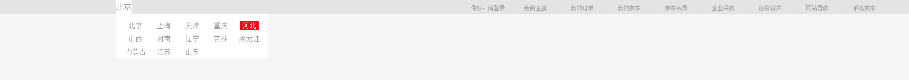

[TOC]

## 京东商城顶部导航栏

第一步:清除浏览器的默认样式,编写导航栏,效果图

styles.css
```css
* {
    margin: 0;
    padding: 0;
}

ul {
    list-style: none;
}

.topheader {
    height: 30px;
    background: #e3e4e5;
    color: #999;
}

.topheader .header-content {
    margin-left: 50px;
    margin-right: 50px;
    height: 100%;
    background: green;
}


```
html代码
```html
<link rel="stylesheet" href="styles.css">  
<!-- ... 省略了一部分标签-->
<div class="topheader">
    <div class="header-content"></div>
</div>
```
[代码演示平台 第一步](https://plnkr.co/edit/lwtZmFvesLAceIRE6zwF?p=preview)

## 第二步:编写导航菜单
>提示: 使用 line-height与父元素高度一致，加上text-center可以实现菜单字体竖直水平居中


主要的html代码
```html
 <div class="topheader">
        <div class="header-content">
            <div class="leftMenu">
                <dt class="menuItem">北京</dt>
            </div>
            <div class="rightMenu">
                <div class="serviceMenu">
                    <div class="serviceMenuItem">你好，请登录</div>
                    <div class="serviceMenuItem">免费注册</div>
                    <span class="spacer"></span>
                    <div class="serviceMenuItem">我的订单</div>
                    <span class="spacer"></span>
                    <div class="serviceMenuItem">我的京东</div>
                    <span class="spacer"></span>
                    <div class="serviceMenuItem">京东会员</div>
                    <span class="spacer"></span>
                    <div class="serviceMenuItem">企业采购</div>
                    <span class="spacer"></span>
                    <div class="serviceMenuItem">服务客户</div>
                    <span class="spacer"></span>
                    <div class="serviceMenuItem">网站导航</div>
                    <span class="spacer"></span>
                    <div class="serviceMenuItem">手机京东</div>
                </div>
            </div>
        </div>
    </div>

```
主要css
```css
.leftMenu {
    margin-left: 200px;
    height: 100%;
    float: left;
    text-align: center;
}

.rightMenu {
    float: right;
    height: 100%;
}

.menuItem {
    line-height: 30px;
    display: inline-block;
}

.serviceMenu {
    display: inline-block;
}

.serviceMenu .serviceMenuItem {
    float: left;
    font-size: 8px;
    margin: 10px 20px;
}


/** 竖线*/

.spacer {
    float: left;
    overflow: hidden;
    margin: 11px 5px 0;
    width: 1px;
    height: 10px;
    background-color: #ccc;
}
```
* [代码演示 第二步](https://plnkr.co/edit/UPwDvoDHFZlbYnqQkA7R?p=preview)

## 第三步: 完成鼠标悬停城市，显示下拉菜单
预览效果


> 提示 :
1.  html结构如下
```html
<!--左侧菜单-->
<div class="leftMeu">
    <dl class="city">
        <dt class="menuItem">北京</dt>
        <dd>
            <ul>
            <li><a href="#">北京</a></li>
            <li><a href="#">上海</a></li>
            <li><a href="#">湖北</a></li>
            <!--这里省略掉其他城市-->
            </ul>
        </dd>
    </dl>
</div>

```

主要的css如下,
1. 将父元素的city设置position:relattive,子元素的样式设置为position:absolute;则可以绝对定位，使下拉的城市菜单显示在北京这个菜单下面了
2. 下拉菜单设置宽度300px; 且所有的菜单项目都是自动左浮动，宽度60px,这样一行能显示5个城市
```css
body{
    background:#f6f6f6;
}
.city{
    position:relative;

}

.city  dd{
    position:absolute;

}

.city  dd ul{
    width:300px;
    padding:10px;
}

.city dd ul li {
    float:left;
    width:60px;
    padding:2px 0;
}


```
* [代码演示 第三步](https://plnkr.co/edit/ZyZemhVRJ5tW4T4rBYim?p=preview)


# 第四步:鼠标悬停地址,显示下拉菜单
> 提示:  原理是 下面一段css,默认子元素隐藏,当鼠标悬停父元素的时候.子元素显示

鼠标未悬停`城市`时


鼠标悬停`城市`时


```css
 .parent  child{
     display:none;
 }
  .parent:hover  child{
    display:block;
  }
```


* [代码演示 第四步 ](http://htmlpreview.github.io/?https://github.com/24wings/tutorial/blob/master/css/demos/jingdong-navbar.3.html)


# 第五步:请自主完成整个导航栏其他部分