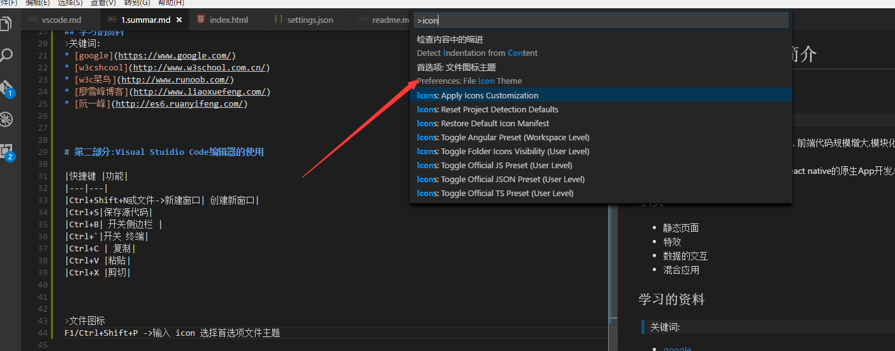

# 第一部分:web前端简介
## web前端的趋势

> web前端的趋势
* 界面更优美,前端担负更重的业务 , 前端代码规模增大,模块化开发,mvc,mvvm等开发方式
* 后端入侵,nodejs开发服务器后台
* 移动端,cordova混合型app,以及react native的原生App开发,NodeWebkit和Electron是桌面端的开发


## 职责
* 静态页面
* 特效
* 数据的交互
* 混合应用


## 学习的资料
>关键词: 
* [google](https://www.google.com/)
* [w3cshcool](http://www.w3school.com.cn/)  
* [w3c菜鸟](http://www.runoob.com/)
* [廖雪峰博客](http://www.liaoxuefeng.com/)
* [阮一峰](http://es6.ruanyifeng.com/)


# 第二部分:Visual Stuidio Code编辑器的使用

|快捷键|功能|
|---|---|
|Ctrl+Shift+N或文件->新建窗口| 创建新窗口|
|Ctrl+S|保存源代码|
|Ctrl+B| 开关侧边栏 |
|Ctrl+`|开关 终端|
|Ctrl+C | 复制|
|Ctrl+V |粘贴|
|Ctrl+X |剪切|
|Home/End |行首/行末|
|Ctrl+Home/Ctrl+End|文件头部/文件尾部|
|使用技巧|方法|
|---|---|
|多个文件编辑窗口|鼠标右键打开到侧边栏|


>文件图标
F1或Ctrl+Shift+P ->输入 icon  选择->首选项文件主题->选择Vscode icons



Zen Code语法
> ! + Tab键  生成下列代码
```html
<html lang="en">
<head>
    <meta charset="UTF-8">
    <title>Document</title>
</head>
<body>
    
</body>
</html>
```

> form>input.username+input.password  + Tab键 生成下列代码

> `>`是指form下有两个input输入框, `+`是指两个输入框是兄弟元素,并列在form 内部
```html
<form action="">
<input type="text" class="username">
<input type="text" class="password">
</form>
```


> ul>li{项目$}*6 + Tab键  生成下列代码

>`$`是指当前迭代的下标,从1开始. `*6`代码有6个这样的元素

```html
<ul>
    <li>项目1</li>
    <li>项目2</li>
    <li>项目3</li>
    <li>项目4</li>
    <li>项目5</li>
    <li>项目6</li>
</ul>
```

> input[type=text] 会生成下列代码

> `[]`输入的是html的标签的属性
```html
<input type="text">
```


# 课后习题

|题目 |详情|
|---|---|
|编辑器的使用 |创建D:/workspace/html的项目|
||创建index.html,并编写第一个hello world页面 |
||练习使用 zencode语法完成上面的例子|


