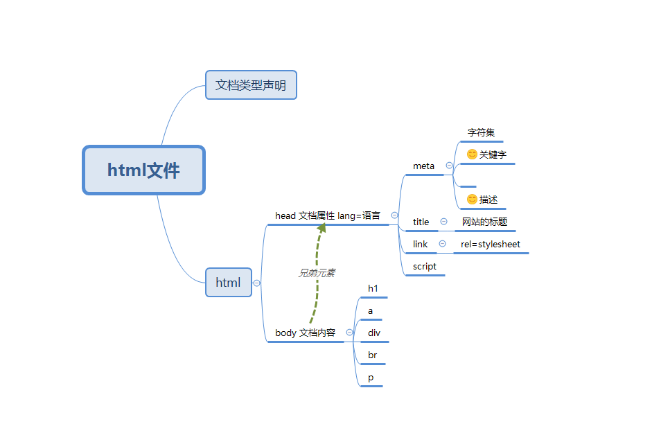

# html简介

> 参考文档
* [参考文档](http://www.runoob.com/html/)

> ! +Tab键 生成如下页面


> 一般html文档的第一行会有   文档类型定义/DTD(Document Type Definition) 

> DTD中声明了html以什么方式解析,有什么样的标签可以使用,我们默认使用html5的文档类型。 参考文档[w3c school html_doctype](http://www.w3school.com.cn/tags/tag_doctype.asp)

* 其中 html4的Transitional

|html类型 |DTD|含义|
|---|---|---|
|HTML 5| `<!DOCTYPE html>`|HTML5文档|
|HTML 4.01 Strict|`<!DOCTYPE HTML PUBLIC "-//W3C//DTD HTML 4.01 Transitional//EN" "http://www.w3.org/TR/html4/loose.dtd">`|严格类型|
|HTML 4.01 Transitional | `<!DOCTYPE HTML PUBLIC "-//W3C//DTD HTML 4.01 Transitional//EN"  "http://www.w3.org/TR/html4/loose.dtd">`|过渡类型,多一些标签|
| HTML 4.01 Frameset |` <!DOCTYPE HTML PUBLIC "-//W3C//DTD HTML 4.01 Frameset//EN" "http://www.w3.org/TR/html4/frameset.dtd">` |框架集类型,允许框架集内容|


```html
<!DOCTYPE html>
<html lang="en">
<head>
    <meta charset="UTF-8">
    <title>Document</title>
</head>
<body>
    
</body>
</html>
```


## html基本元素
[xmind源文件](resources/html文件.xmind)

;

```
<!--lang属性是指定语言的,让浏览器对用户更友好,比如在这里我们指定了中文 -->
<html lang="zh-CN">
```

每一份html的基础结构都是如上图

* 文档类型声明
* html 
    * head
        * meta 例如 charset,keywords,description
        * title 网站标题
        * link,script
    * body
        * 网站的显示内容 
        * h1 ,title这些


## 标签之间的关系
> 类似 html下面有head标签称 html和head是父子关系。

> 类似 html下面有head和body,称head和body是兄弟关系。


## 基础标签

|标签|属性| 含义|
|---|---|---|
|a标签|title属性: [鼠标停留文字](https://htmlpreview.github.io/?https://github.com/24wings/tutorial/blob/master/html/demos/demo1.html) |超链接|
||href属性:指定超链接地址|
||target属性:打开网页的方式,blank新页面,|
|img|src属性 source指定源|图片|
|p | |段落|
|h1-h6| |标题1-标题6|
|br| |换行符|
|hr ||水平线|


## 课后作业
1. 编写一个页面,[在线预览](https://htmlpreview.github.io/?https://github.com/24wings/tutorial/blob/master/html/demos/html_summary_homework.html)

[源代码](demos/html_summary_homework.html)

