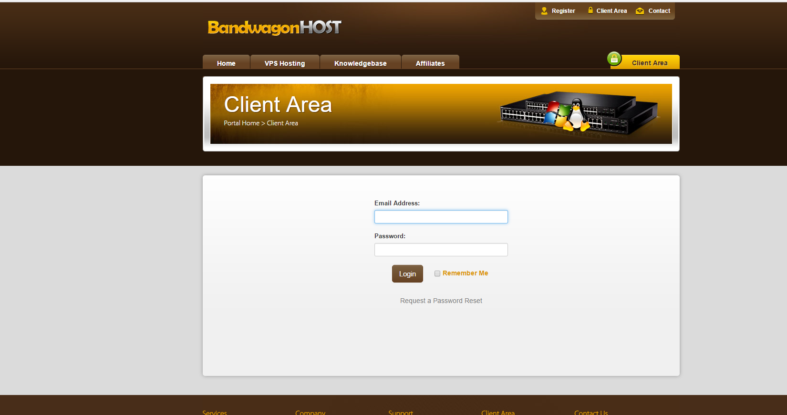

# shadowsocks的下载安装以及使用
shadowsocks是翻墙的工具之一。翻墙后可以访问
* [谷歌](https://www.google.com/)
* [Facebook](https://www.facebook.com/)
* [Youtube](https://www.youtube.com/)

1. 登陆[bwh1.net](https://bwh1.net/)  并点击Client Area进入登陆页面 输入账号密码

账号: 731502029@qq.com 
密码: lvzijia

2. 登陆后台my service查看自己的虚拟主机,

3. 下载并配置shadowsocks

`可以直接点击这个来下载配置shadowsocks,无需前面的登陆等操作`
* [win7或者更早](resources/shadowsocks-win-2.3.zip)
* [win8或者win10等](resource/shadowsocks-win-dotnet4.0-2.3.zip)

当前服务器配置

ServerIp:23.106.138.147
ServerPort: 443
Password:N2Y2ZTYyYj
Encryption:aes-256-cfb
ProxyPort:1080

* 配置好了

* 启动系统代理
* 设置开机自启动

4. 打开浏览器,输入google.com

