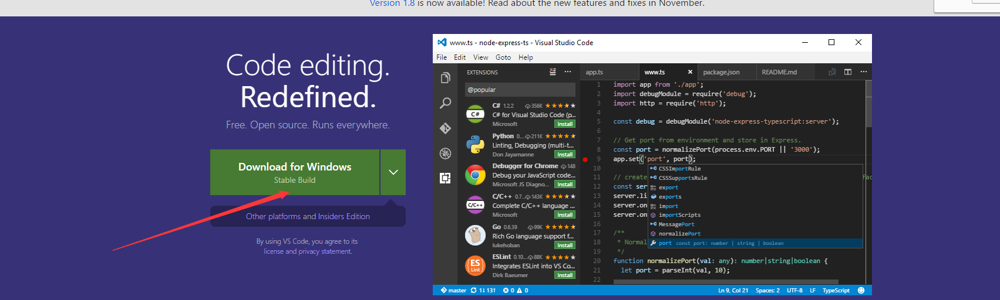
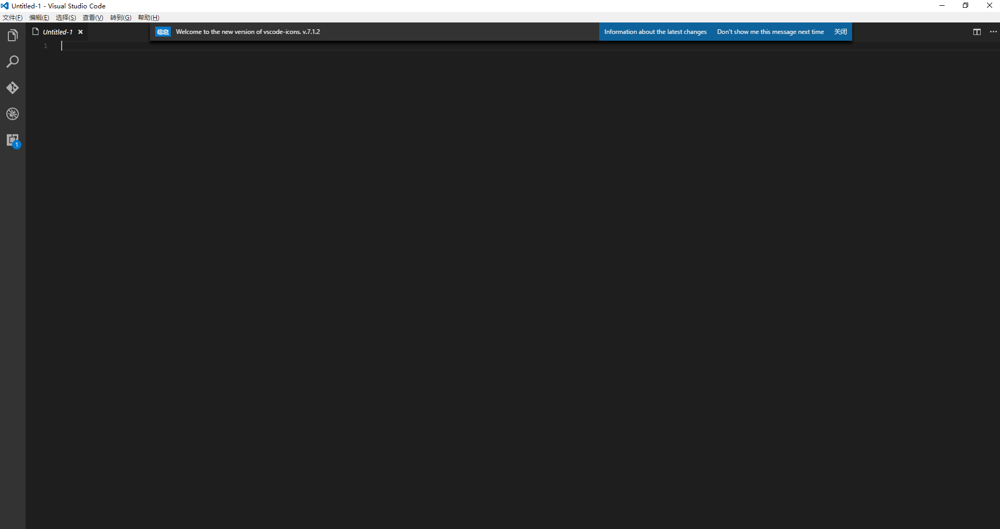
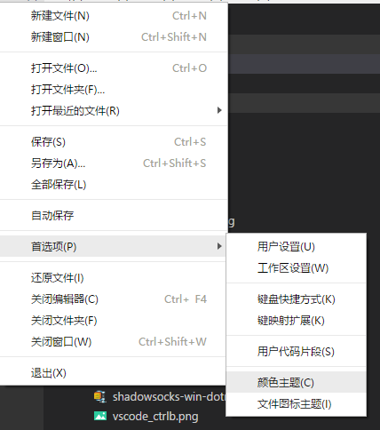
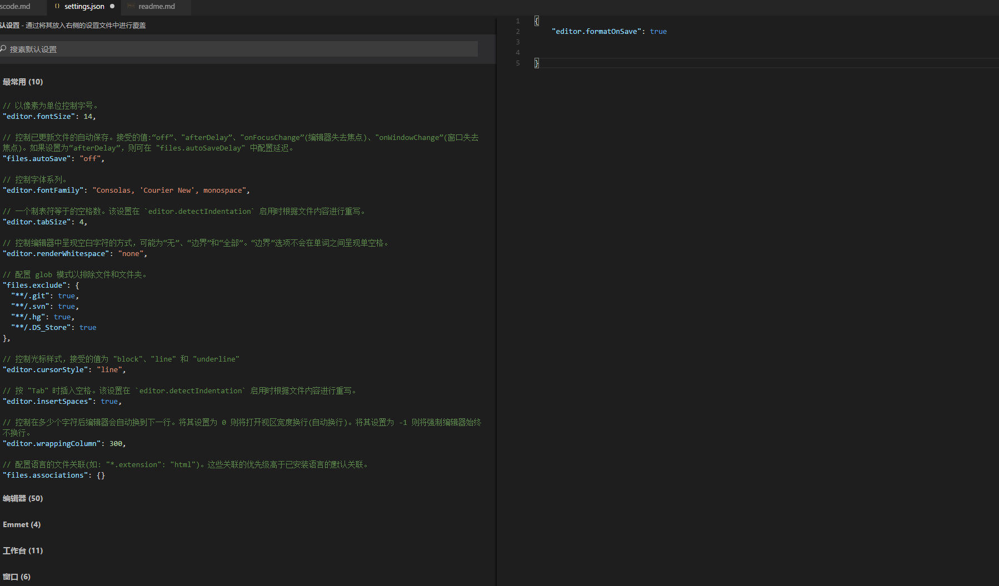

# Visual Studio Code 的使用

## 下载Vscode
1. 搜索关键字 vscode
2. 下载vscode

# 安装好vscode的

* 需要以文件夹打开一个项目,一般我们可以选择d盘的workspace作为我们的项目文件夹,

> 左侧边栏有5个按钮

* 文件管理器
* 搜索
* git代码管理
* debug工具
* 插件

> 常用快捷键 

* ctrl+b　开关左侧菜单栏
* ctrl+f 搜索关键字 
* F1 打开帮助
* ctrl+s 保存代码
* ctrl+` 打开终端相当于 命令提示符cmd  

> 配置vscode
* 选择主题  文件->首选项->颜色主题 
* 自动格式化代码   文件->首选项->用户设置  加入 editor.formatOnSave=true 

* 插件
下载量多的插件,推荐的插件

|插件名字|插件功能|使用方式|
|---|---|---|
|view in Browser| 查看页面效果|右键左侧边栏的html文件,点击view in browser|
|Code Runner | 直接运行代码，如java,javascript,typescript,c#,python,go等|右键|
|HTML Snippets | HTML智能语法提示 ||
|Path Intellisense  | 文件夹以及文件的路径自动补全||
|vscode-icons  | vscode 文件图标 |F1  输入icon  选择文件图标主题 选择vscode icon|
|JS-CSS-HTML Formatter| 格式化html+css+js||

## 课后习题
* 用vscode 创建 d:/workspace/html  下的index.html文件
* 并用!+tab建写一个hello world 页面。 打乱hello world之间的空格,并使用ctrl+s保存查看是否会自动化格式化代码。
* 使用view in browser 来查看hello world页面

